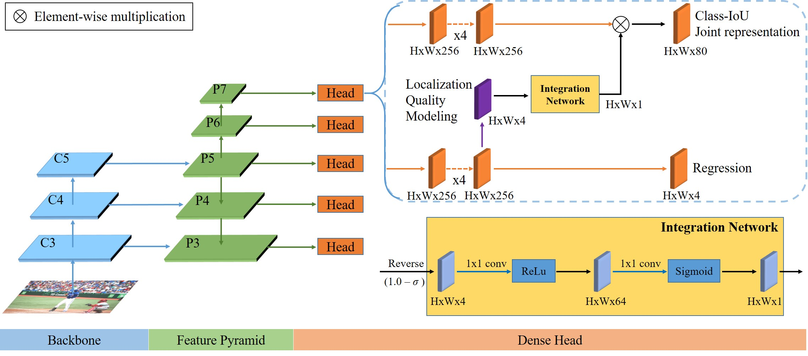

# Improving Object Detection by Estimating Bounding Box Quality Accurately

## Abstract

Object detection aims to locate and classify object instances in images. Therefore, the object detection model is generally implemented with two parallel branches to optimize localization and classification. After training the detection model, we should select the best bounding box of each class among a number of estimations for reliable inference. Generally, NMS (Non Maximum Suppression) is operated to suppress low-quality bounding boxes by referring to classification scores or center-ness scores. However, since the quality of bounding boxes is not considered, the low-quality bounding boxes can be accidentally selected as a positive bounding box for the corresponding class. We believe that this misalignment between two parallel tasks causes degrading of the object detection performance. In this paper, we propose a method to estimate bounding boxes' quality using four-directional Gaussian quality modeling, which leads the consistent results between two parallel branches. Extensive experiments on the MS COCO benchmark show that the proposed method consistently outperforms the baseline (FCOS). Eventually, our best model offers the state-of-the-art performance by achieving 48.9% in AP. We also confirm the efficiency of the method by comparing the number of parameters and computational overhead.

## Overall Architecture


## Implementation Details
We implement our detection model on top of MMDetection (v2.6), an open source object detection toolbox. If not specified separately, the default settings of FCOS implementation are not changed. We train and validate our network on four RTX TITAN GPUs in the environment of Pytorch v1.6 and CUDA v10.2.

Please see [GETTING_STARTED.md](https://github.com/open-mmlab/mmdetection/blob/v2.6.0/docs/get_started.md) for the basic usage of MMDetection.

## Installation
---
1. Clone the this repository.

    ```shell
    git clone https://github.com/sanghun3819/LQM.git
    cd LQM
    ```

2. Create a conda virtural environment and install dependencies.
    ```shell
    conda env create -f environment.yml
    ```
3. Activate conda environment 
    ```shell
    conda activate lqm
    ```
4. Install build requirements and then install MMDetection.
    ```shell
    pip install --force-reinstall mmcv-full==1.1.5 -f https://download.openmmlab.com/mmcv/dist/cu102/torch1.6.0/index.html
    pip install -v -e .
    ```
## Preparing MS COCO dataset
---
  ```shell
  bash download_coco.sh
  ```
## Preparing Pre-trained model weights
---
  ```shell
  bash download_weights.sh
  ```
## Train
---
```python
# assume that you are under the root directory of this project,
# and you have activated your virtual environment if needed.
# and with COCO dataset in 'data/coco/'

./tools/dist_train.sh configs/uncertainty_guide/uncertainty_guide_r50_fpn_1x.py 4 --validate
```

## Inference
---
```python
./tools/dist_test.sh configs/uncertainty_guide/uncertainty_guide_r50_fpn_1x.py work_dirs/uncertainty_guide_r50_fpn_1x/epoch_12.pth 4 --eval bbox
```

## Image demo using pretrained model weight
---
```python
# Result will be saved under the demo directory of this project (detection_result.jpg)
# config, checkpoint, source image path are needed (If you need pre-trained weights, you can download them from provided google drive link)
# score threshold is optional

python demo/LQM_image_demo.py --config configs/uncertainty_guide/uncertainty_guide_r50_fpn_1x.py --checkpoint work_dirs/pretrained/LQM_r50_fpn_1x.pth --img data/coco/test2017/000000011245.jpg --score-thr 0.3
```

## Webcam demo using pretrained model weight
---
```python
# config, checkpoint path are needed (If you need pre-trained weights, you can download them from provided google drive link)
# score threshold is optional

python demo/webcam_demo.py configs/uncertainty_guide/uncertainty_guide_r50_fpn_1x.py work_dirs/pretrained/LQM_r50_fpn_1x.pth
```
## Models
---
For your convenience, we provide the following trained models. All models are trained with 16 images in a mini-batch with 4 GPUs.

Model | Multi-scale training | AP (minival) | Link
--- |:---:|:---:|:---:
LQM_R50_FPN_1x              | No  | 40.0 | [Google](https://drive.google.com/file/d/1D-Bp1I3AhymPDiR2GWVcQusF_o9q9lVL/view?usp=sharing)
LQM_R101_FPN_2x             | Yes | 44.8 | [Google](https://drive.google.com/file/d/1T4e9qkT4w5Rbue_nbba9Thrje4E6Q5um/view?usp=sharing)
LQM_R101_dcnv2_FPN_2x       | Yes | 47.4 | [Google](https://drive.google.com/file/d/1o79wRRhEe3HwiWwxHIG69VGjk5RIpGQ2/view?usp=sharing)
LQM_X101_FPN_2x             | Yes | 47.2 | [Google](https://drive.google.com/file/d/1hfD0cGvJd2ZO2FiVmFzoQEGBjjVuRB52/view?usp=sharing)
LQM_X101_dcnv2_FPN_2x       | Yes | 48.9 | [Google](https://drive.google.com/file/d/1TAsQntoprgIYXiFCA1BJJ2IOpY3MdmpX/view?usp=sharing)